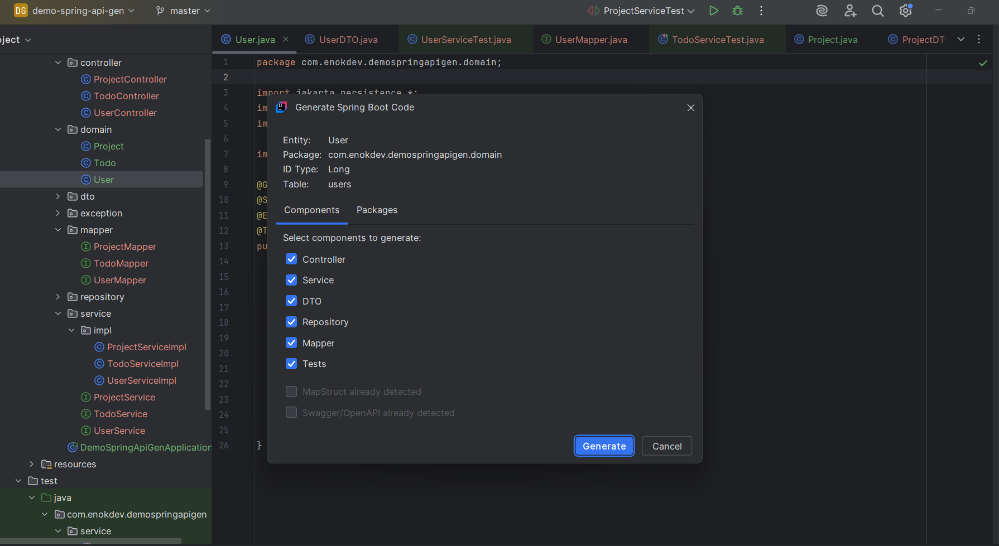
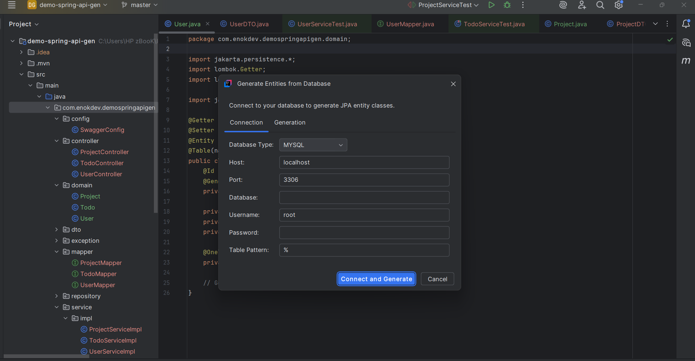

# Spring Boot Code Generator - IntelliJ Plugin

## Overview

Spring Boot Code Generator is an IntelliJ IDEA plugin that automatically generates a complete Spring Boot application structure from JPA entities or database schemas. This plugin accelerates development by creating controllers, services, repositories, DTOs, and other components following best practices.

## Features

- **JPA Entity Analysis**: Automatically detects and analyzes JPA entities in your project
- **API Layer Generation**: Creates RESTful controllers with CRUD operations for your entities
- **Service Layer Generation**: Generates service interfaces and implementations
- **Data Access Layer**: Creates Spring Data repositories for database operations
- **DTO Management**: Builds Data Transfer Objects for your entities with validation
- **Integration with MapStruct**: Generates mappers for entity-DTO conversions
- **Relationship Handling**: Special controllers and methods for managing entity relationships
- **Unit Testing**: Generates test classes with JUnit 5 and Mockito
- **Swagger Documentation**: Automatically configures OpenAPI documentation
- **Error Handling**: Global exception handler with proper HTTP status codes
- **Database Reverse Engineering**: Generate JPA entities from existing database schemas
- **Spring Security Integration** (New in 1.1.0): Generate JWT-based authentication, user management, and endpoint security
- **GraphQL Support** (New in 1.1.0): Generate GraphQL schemas, resolvers, types, and mutations from your entities
- **Kotlin Support** (New in 1.2.0): Automatic detection of Kotlin projects and generation of idiomatic Kotlin code

## Installation

### From JetBrains Marketplace

1. Open IntelliJ IDEA
2. Go to `Settings` → `Plugins` → `Marketplace`
3. Search for "Spring Boot Code Generator"
4. Click `Install` and restart the IDE

### Manual Installation

1. Download the latest plugin JAR from the [Releases](https://github.com/tky0065/spring-api-generator/releases)
2. Open IntelliJ IDEA
3. Go to `Settings` → `Plugins` → ⚙️ → `Install Plugin from Disk...`
4. Select the downloaded JAR file
5. Restart the IDE

## Usage

### Generating Code from JPA Entities

1. Open a JPA entity class in the editor
2. Right-click on the editor and select `Generate Spring REST Code`
3. In the dialog that appears:
   - Select the components to generate (Controller, Service, DTO, etc.)
   - Configure package names for generated code
   - Click `Generate`

### Reverse Engineering from Database

1. Right-click on your project in the Project panel
2. Select `Spring Boot Code Generator` → `Generate from Database`
3. Configure database connection settings:
   - Select database type (MySQL, PostgreSQL, H2)
   - Enter connection details
   - Select tables to include
4. Click `Generate` to create JPA entities and related components

### Générer une Configuration de Sécurité (Nouveau dans 1.1.0)

1. Cliquez-droit sur votre projet dans le panneau Projet
2. Sélectionnez `Spring Boot Code Generator` → `Generate Security Configuration`
3. Dans la boîte de dialogue :
   - Choisissez le type d'authentification (JWT, Basic Auth, ou OAuth2)
   - Configurez les options de sécurité (expiration du token, règles CORS, etc.)
   - Sélectionnez les endpoints à sécuriser
4. Cliquez sur `Generate` pour créer les composants de sécurité :
   - Configuration Spring Security
   - Classes d'authentification et d'autorisation
   - Gestionnaire de jetons JWT
   - Endpoints d'authentification (login, register, etc.)
   - Modèle utilisateur et repository

### Générer une API GraphQL (Nouveau dans 1.1.0)

1. Sélectionnez une ou plusieurs entités JPA dans l'éditeur ou le panneau Projet
2. Cliquez-droit et sélectionnez `Spring Boot Code Generator` → `Generate GraphQL API`
3. Dans la boîte de dialogue :
   - Choisissez les opérations GraphQL à générer (queries, mutations)
   - Configurez les options de pagination et de filtrage
   - Personnalisez les noms des types et champs GraphQL
4. Cliquez sur `Generate` pour créer :
   - Schéma GraphQL (.graphqls)
   - Résolveurs GraphQL (Query et Mutation)
   - Types d'entrée et de sortie
   - Configuration GraphQL

## Configuration Options

### Component Selection

- **Controller**: REST controller with CRUD operations and relation management
- **Service**: Business logic layer with interface and implementation
- **Repository**: Spring Data JPA repository interface
- **DTO**: Data Transfer Objects with validation annotations
- **Mapper**: MapStruct mapper interfaces for entity-DTO conversions
- **Tests**: Unit tests with JUnit 5 and Mockito

### Package Configuration

You can customize the package structure for generated components:

- **Base Package**: Root package for all generated code
- **Domain Package**: Package for entity classes
- **Controller Package**: Package for REST controllers
- **Service Package**: Package for service interfaces and implementations
- **Repository Package**: Package for repository interfaces
- **DTO Package**: Package for Data Transfer Objects
- **Mapper Package**: Package for MapStruct mappers

## Project Integration

The plugin integrates with Spring Boot projects and works with:

- Spring Boot 2.x and 3.x
- Java 8, 11, 17, 21
- Gradle and Maven projects
- JPA annotations (javax.persistence.* or jakarta.persistence.*)
- Lombok for reducing boilerplate code
- MapStruct for entity-DTO mapping
- JUnit 5 and Mockito for testing

## Requirements

- IntelliJ IDEA (Community or Ultimate) 2023.1 or later
- Java 11 or later

## Contributing

Contributions are welcome! Please feel free to submit a Pull Request.

1. Fork the repository
2. Create your feature branch (`git checkout -b feature/amazing-feature`)
3. Commit your changes (`git commit -m 'Add some amazing feature'`)
4. Push to the branch (`git push origin feature/amazing-feature`)
5. Open a Pull Request

## License

This project is licensed under the MIT License - see the [LICENSE](LICENSE) file for details.

## Support

If you encounter any issues or have questions, please file an issue on our [GitHub repository](https://github.com/tky0065/spring-api-generator/issues).

## 📚 Documentation

### Guides Complets
- **[Guide d'Installation](docs/INSTALLATION.md)** - Instructions détaillées d'installation et configuration
- **[Guide Utilisateur](docs/USER_GUIDE.md)** - Guide complet d'utilisation du plugin
- **[Guide Développeur](docs/DEVELOPER_GUIDE.md)** - Documentation pour contribuer au projet

### Documentation Technique
- **[Conventions de Nommage](docs/NAMING_CONVENTIONS.md)** - Standards et conventions utilisés dans le code généré
- **[Guide de Dépannage](docs/TROUBLESHOOTING.md)** - Solutions aux problèmes courants et diagnostic
- **[Exemples de Code Généré](docs/CODE_EXAMPLES.md)** - Exemples complets du code produit par le plugin

---

Developed with ❤️ by [EnokDev](https://enokdev-com.vercel.app)
